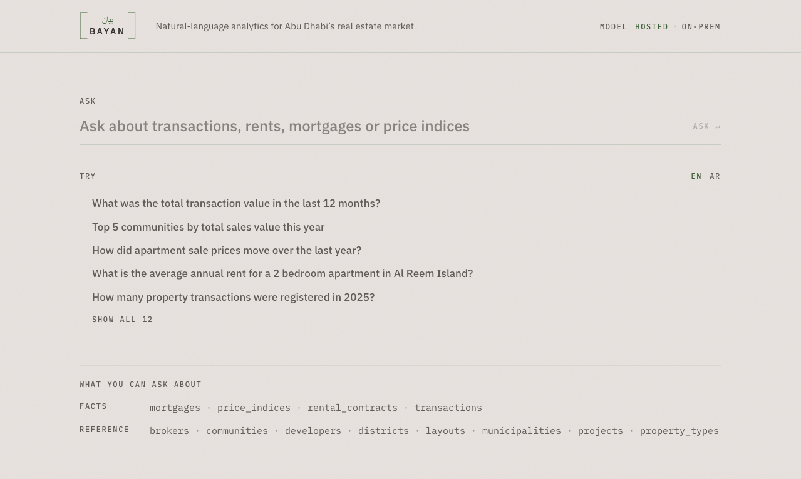
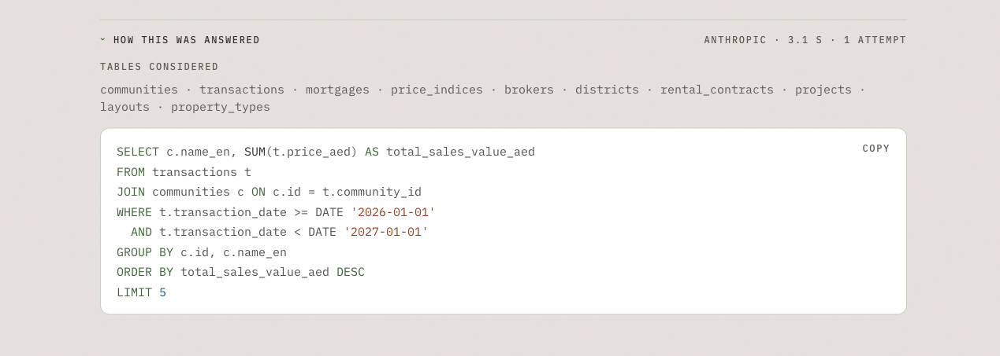
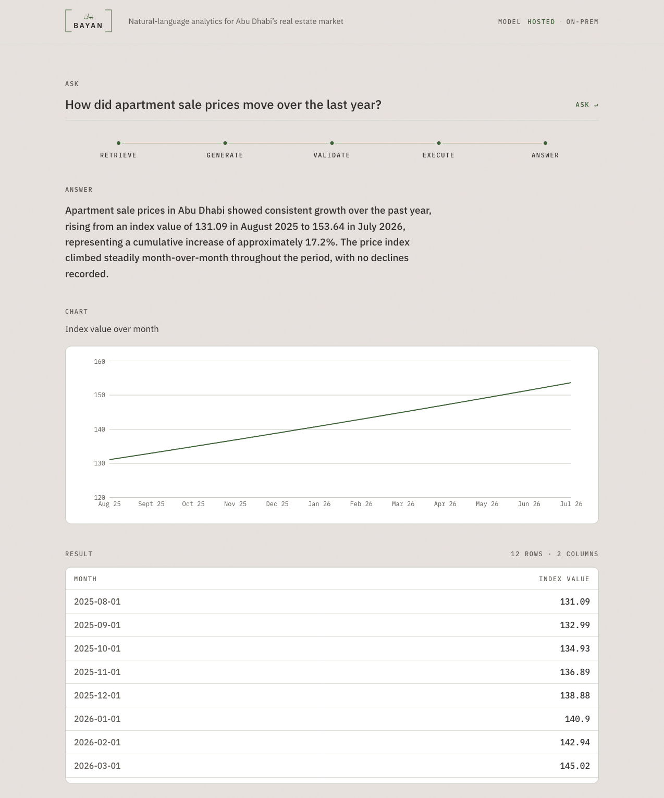
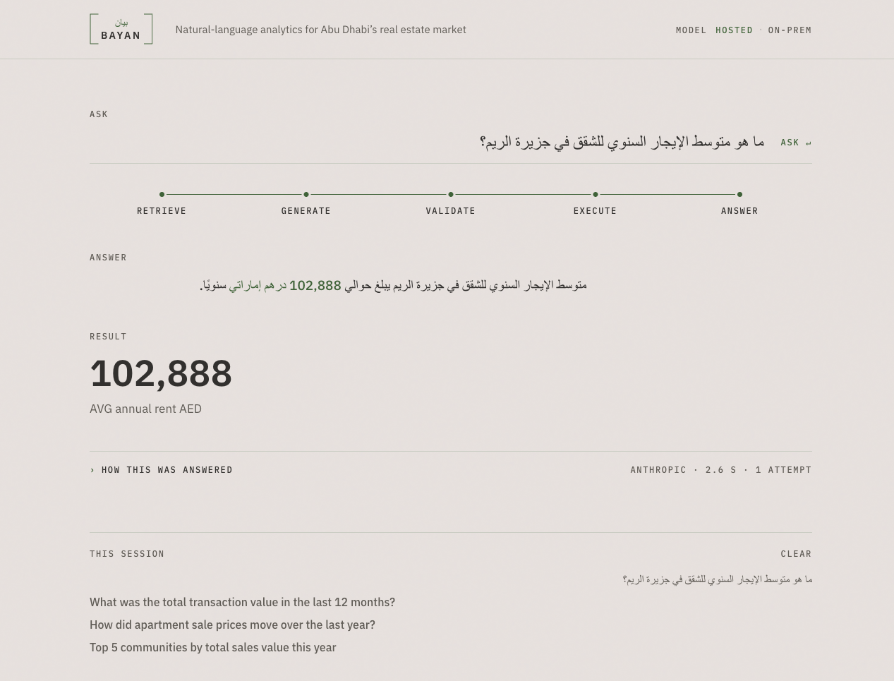
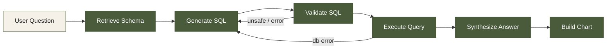

# Bayan — Natural-Language Analytics for Real Estate

A natural-language analytics tool that lets users query Abu Dhabi real estate data by asking plain-language questions. Ask a question in English or Arabic, get a synthesized answer backed by validated SQL, result tables, and auto-generated charts.

Built as a proof-of-concept to explore how NL→SQL pipelines can unlock analytical value from structured real estate datasets — covering transactions, rental contracts, mortgages, price indices, and broker registrations.

> **Note:** All data is synthetic, structurally modeled after published ADREC aggregates. This is not an official ADREC product.

## Screenshots

<p align="center">
  
</p>

<p align="center">
  
</p>

<p align="center">
  
</p>

<p align="center">
  
</p>

## Architecture

The backend orchestrates a multi-step LangGraph pipeline that retrieves relevant schema context, generates SQL, validates it for safety, executes it against a read-only database role, and synthesizes a natural-language answer with an auto-generated chart spec.



Validation and execution failures route back to generation with classified feedback (up to 3 attempts). Every generated query is AST-checked via sqlglot, executed under a read-only Postgres role, and has a row limit and statement timeout enforced.

## Tech Stack

| Layer | Technology |
|-------|-----------|
| **Frontend** | Next.js 16, React 19, TypeScript, Tailwind CSS, shadcn/ui, Recharts |
| **Backend** | Python 3.11, FastAPI, LangGraph, LangChain Core |
| **Database** | PostgreSQL 16 |
| **LLM** | Anthropic Claude (hosted) / Ollama (on-prem) — switchable per request |
| **SQL Safety** | sqlglot AST validation, read-only DB role, row limits, statement timeout |

## Getting Started

### Prerequisites

- Docker & Docker Compose
- Node.js 20+
- An Anthropic API key (or a local Ollama instance)

### Setup

1. **Clone the repo**

   ```bash
   git clone https://github.com/Nahyan04/nl2sql-real-estate-tool.git
   cd nl2sql-real-estate-tool
   ```

2. **Configure environment**

   ```bash
   cp backend/.env.example backend/.env
   # Edit backend/.env — set your ANTHROPIC_API_KEY
   
   cp frontend/.env.local.example frontend/.env.local
   ```

3. **Start the backend** (Postgres + API)

   ```bash
   docker compose up
   ```

4. **Seed the database**

   ```bash
   cd backend && python scripts/seed_db.py && python scripts/generate_dataset.py
   ```

5. **Start the frontend**

   ```bash
   cd frontend && npm install && npm run dev
   ```

   Open [http://localhost:3000](http://localhost:3000).

## Project Structure

```
backend/
  app/
    api/routes/        — query, schema, examples, health endpoints
    core/              — config, database, LLM factory, prompt builder
    services/          — LangGraph pipeline, schema introspection, SQL
                         validation, executor, answer synthesis, chart spec
    models/            — Pydantic request/response schemas
    resources/         — schema aliases (EN + AR synonyms)
  db/                  — SQL schema and seed scripts
  scripts/             — dataset generation and seeding
  tests/               — unit, integration, and golden-question eval
frontend/
  src/app/             — Next.js App Router pages
  src/components/      — query input, answer panel, SQL viewer, chart, table
  src/lib/             — API client, types
```

## Key Features

- **Natural-language queries** — ask about transactions, rents, mortgages, or price indices in plain English or Arabic
- **SQL transparency** — every answer shows the validated SQL that produced it
- **Auto-generated charts** — bar, line, and headline-figure visualizations picked automatically based on the result shape
- **Bilingual support** — Arabic questions get RTL layout and Arabic answers
- **LLM flexibility** — toggle between Anthropic (hosted) and Ollama (on-prem) from the UI
- **Safety-first execution** — sqlglot read-only validation, DB-level read-only role, row limits, and statement timeouts

## License

This project is provided as-is for demonstration purposes.